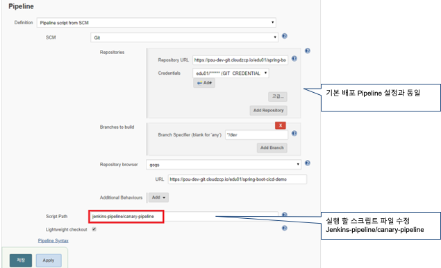
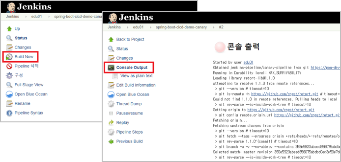
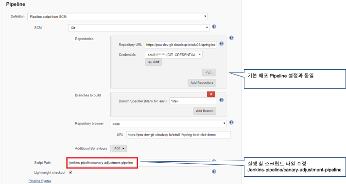
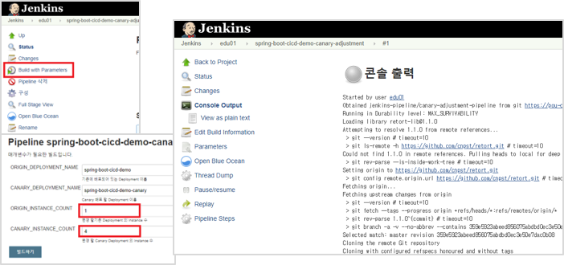

# Step 04. Canary Deploy

Canary Deploy 시나리오
```
1. 기존의 서비스 중이던 Application Instance는 5개
2. 신규 기능을 추가하여, 정상동작 확인과 사용성을 확인 하기 위해 Canary 적용
3. 신규 버전의 Application Instance 1개를 배포
4. 기존 버전의  Instance 숫자를 4개로 줄임
5. 동작확인과 사용성 확인후 신규 버전으로 전체 서비스 교체
```


## Deployment-canary.yaml 작성

* spec.strategy.type: RollUpdate

```yaml
apiVersion: apps/v1
kind: Deployment
metadata:
  name: spring-boot-cicd-demo-canary
  labels:
    app: spring-boot-cicd-demo
spec:
  replicas: 1
  selector:
    matchLabels:
      app: spring-boot-cicd-demo
  strategy:
    type: RollingUpdate
  template:
    metadata:
      labels:
        app: spring-boot-cicd-demo
    spec:
      imagePullSecrets:
        - name: harbor-secret
      containers:
      - name: spring-boot-cicd-demo
        image: labs-registry.cloudzcp.io/[edu1]/spring-boot-cicd-demo:prod
        ports:
        - containerPort: 8080
          name: tomcat
        resources:
          limits:
            cpu: 500m
            memory: 512Mi
          requests:
            cpu: 10m
            memory: 256Mi

```
## Pipeline 작성
spring-boot-cicd-demo-dev-canary 이름으로 Pipeline작성

[Step 02 Documentation 참조](step02.md)

1. Pipeline Script Path 수정 : jenkins-pipeline/canary-pipeline



2. jenkins script 작성

```groovy
@Library('retort-lib') _
def label = "jenkins-${UUID.randomUUID().toString()}"
 
def ZCP_USERID = 'edu01'
def DOCKER_IMAGE = 'edu01/spring-boot-cicd-demo'
def K8S_NAMESPACE = 'edu01'
def VERSION = ‘prod’
def TYPE = ＇deployment‘
def DEPLOY_NAME = ＇spring-boot-cicd-demo‘ // Previous Deployment
...
        stage(＇DEPLOY＇) {
            container(＇kubectl＇) {
                // canary deployment 생성
                kubeCmd.apply file: 'k8s/deployment-canary.yaml', namespace: K8S_NAMESPACE, wait: 300
                // 기존 deployment 의 Instance 수를 4개로 조정
                kubeCmd.scale type: TYPE, name: DEPLOY_NAME, replicas: 4, namespace: K8S_NAMESPACE
            }
        }
...
```

3. 실행



## Canary Deploy 조정

### Pipeline 작성
spring-boot-cicd-demo-dev-adjustment 이름으로 Pipeline작성

[Step 02 Documentation 참조](step02.md)

1. Pipeline Script Path 수정 : jenkins-pipeline/canary-adjestment-pipeline
   


2. 매개변수 추가
   
|         매개변수 명         | Default Value                | 설명                       |
| :--------------------: | :--------------------------- | :----------------------- |
| ORIGIN_DEPLOYMENT_NAME | spring-boot-cicd-demo        | 기존에 배포된  Deployment 이름   |
| CANARY_DEPLOYMENT_NAME | spring-boot-cicd-demo-canary | Canary 신규  Deployment 이름 |
| ORIGIN_INSTANCE_COUNT  |                              | Previous Instance  값     |
| CANARY_INSTANCE_COUNT  |                              | New Instance 값           |

3. jenkins script 작성

```groovy
@Library('retort-lib') _
def label = "jenkins-${UUID.randomUUID().toString()}"
 
def ZCP_USERID = 'edu01'
def K8S_NAMESPACE = 'edu01'
def TYPE = 'deployment'

podTemplate(label:label,
    serviceAccount: "zcp-system-sa-${ZCP_USERID}",
    containers: [
        containerTemplate(name: 'kubectl', image: 'lachlanevenson/k8s-kubectl', ttyEnabled: true, command: 'cat')
    ]) {

    node(label) {
        stage('kubectl') {
            container('kubectl') {
                // 기존 Deployment 의 Instance 수를 ORIGIN_INSTANCE_COUNT 값으로 변경
                kubeCmd.scale type: TYPE, name: ORIGIN_DEPLOYMENT_NAME, replicas: ORIGIN_INSTANCE_COUNT, namespace: K8S_NAMESPACE
                // Canary Deployment 의 Instance 수를 CANARY_INSTANCE_COUNT 값으로 변경
                kubeCmd.scale type: TYPE, name: CANARY_DEPLOYMENT_NAME, replicas: CANARY_INSTANCE_COUNT, namespace: K8S_NAMESPACE
            }
        }
    }
}

```

3. 실행
   
   

---
[[toc]]