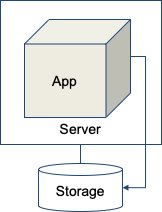
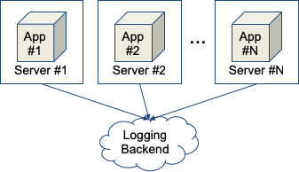
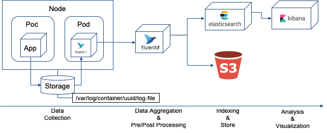
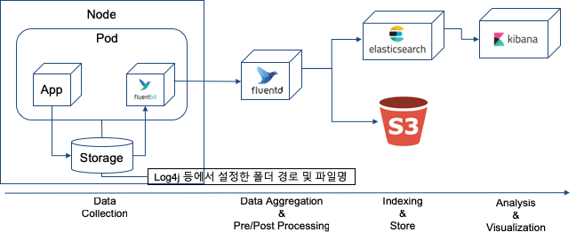

# Logging Overview
::: tip
* 클라우드 환경에서 동적으로 생성되고 소멸되는 Applicarion/Platform Log 복잡도 증가
* 단순 로그에서 분석데이터로 활용
* 로그데이터 관리의 어려움: 출처 확인, 데이터 크기 증가 등
:::

## On-Premise
> * 고사양의 서버에 Application을 크게 운영
> * Log를 Application이 실행 중인 서버 내부에 저장
> * 개발자/운영자는 서버 내부에 접속해 Log를 확인 

## Cloud Native
> * Application을 작게 운영하고 필요할 때 마다 확장
> * 다중 인스턴스의 로그를 효율적으로 검색하기 위해 외부 Log 시스템에 저장
> * 개발자/운영자는 서버에 직접 접속하지 않고 외부 Log Backend에서 로그 확인

## Logging Architecture
> Kubernetes 에서 로그를 관리 하기 위한 Architecture 유형

### DaemonSet Pattern
> * App Console Log가 각 Node의 Storage에 자동 저장
> * 각 Node의 Agent가 Log를 Aggregator로 전달
> * Log data를 전/후 처리 후 Backend로 전달

### Sidecar Pattern
> * App Log를 Pod의 Storage에 파일로 저장(Log4j 등 사용)
> * Pod의 Agent가 Log data를 전/후 처리 후 Backend로 전달
> * Daemonset Pattern과 같이 Pod의 Agent가 Log data를 전/후 처리 후 Aggregator로 전달할 수도 있음

---
[[toc]]